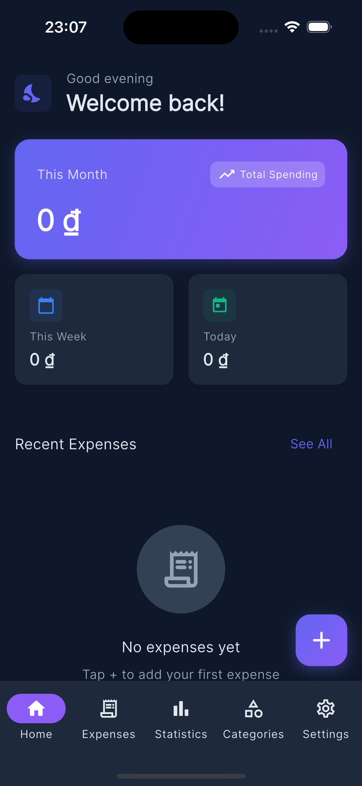

<a id="readme-top"></a>

<!-- PROJECT SHIELDS -->
[![Flutter][Flutter-shield]][Flutter-url]
[![Dart][Dart-shield]][Dart-url]
[![License][license-shield]][license-url]

<!-- PROJECT LOGO -->
<br />
<div align="center">
  <a href="https://github.com/anhnt2003/my_expenses">
    
  </a>

  <h3 align="center">My Expenses</h3>

  <p align="center">
    A beautiful and intuitive personal expense management application built with Flutter
    <br />
    <a href="#getting-started"><strong>Explore the docs »</strong></a>
    <br />
    <br />
    <a href="#usage">View Demo</a>
    ·
    <a href="https://github.com/anhnt2003/my_expenses/issues">Report Bug</a>
    ·
    <a href="https://github.com/anhnt2003/my_expenses/issues">Request Feature</a>
  </p>
</div>

<!-- TABLE OF CONTENTS -->
<details>
  <summary>Table of Contents</summary>
  <ol>
    <li>
      <a href="#about-the-project">About The Project</a>
      <ul>
        <li><a href="#built-with">Built With</a></li>
      </ul>
    </li>
    <li>
      <a href="#getting-started">Getting Started</a>
      <ul>
        <li><a href="#prerequisites">Prerequisites</a></li>
        <li><a href="#installation">Installation</a></li>
      </ul>
    </li>
    <li><a href="#usage">Usage</a></li>
    <li><a href="#features">Features</a></li>
    <li><a href="#architecture">Architecture</a></li>
    <li><a href="#roadmap">Roadmap</a></li>
    <li><a href="#contributing">Contributing</a></li>
    <li><a href="#license">License</a></li>
    <li><a href="#contact">Contact</a></li>
    <li><a href="#acknowledgments">Acknowledgments</a></li>
  </ol>
</details>

---

<!-- ABOUT THE PROJECT -->
## About The Project

<div align="center">
  
</div>

**My Expenses** is a cross-platform personal expense tracking application designed to help you manage your finances effortlessly. Track your daily spending, categorize expenses, and visualize your financial habits with beautiful charts and statistics.

### Key Highlights:
* 📊 **Visual Statistics** - Interactive charts to understand your spending patterns
* 🏷️ **Custom Categories** - Organize expenses with customizable categories and colors
* 🌓 **Dark/Light Mode** - Seamless theme switching based on system preferences
* 📱 **Cross-Platform** - Runs on iOS, Android, and Web
* ⚡ **Fast & Lightweight** - Optimized performance with local data storage

<p align="right">(<a href="#readme-top">back to top</a>)</p>

### Built With

This project is built with modern Flutter ecosystem technologies:

| Technology | Purpose |
|------------|---------|
| [![Flutter][Flutter-shield]][Flutter-url] | Cross-platform UI Framework |
| [![Dart][Dart-shield]][Dart-url] | Programming Language |
| [Riverpod](https://riverpod.dev/) | State Management |
| [GoRouter](https://pub.dev/packages/go_router) | Declarative Navigation |
| [FL Chart](https://pub.dev/packages/fl_chart) | Beautiful Charts |
| [Google Fonts](https://pub.dev/packages/google_fonts) | Typography |

<p align="right">(<a href="#readme-top">back to top</a>)</p>

---

<!-- GETTING STARTED -->
## Getting Started

Follow these steps to get a local copy up and running.

### Prerequisites

Make sure you have the following installed:

* **Flutter SDK** (3.2.0 or higher)
  ```sh
  flutter --version
  ```
* **Dart SDK** (included with Flutter)
* **IDE**: VS Code with Flutter extension or Android Studio

### Installation

1. **Clone the repository**
   ```sh
   git clone https://github.com/anhnt2003/my_expenses.git
   ```

2. **Navigate to project directory**
   ```sh
   cd my_expenses
   ```

3. **Install dependencies**
   ```sh
   flutter pub get
   ```

4. **Run the application**
   ```sh
   # Debug mode
   flutter run

   # Release mode
   flutter run --release
   ```

5. **Build for production**
   ```sh
   # Android APK
   flutter build apk --release

   # iOS
   flutter build ios --release

   # Web
   flutter build web --release
   ```

<p align="right">(<a href="#readme-top">back to top</a>)</p>

---

<!-- USAGE EXAMPLES -->
## Usage

### Adding an Expense

1. Tap the **+** button on the home screen
2. Enter the expense details:
   - Title
   - Amount
   - Category
   - Date
   - Optional note
3. Tap **Save** to record the expense

### Managing Categories

1. Navigate to **Categories** from settings
2. Create custom categories with:
   - Name
   - Icon
   - Color
3. Edit or delete existing categories

### Viewing Statistics

1. Go to the **Statistics** tab
2. View spending breakdown by:
   - Category (Pie Chart)
   - Monthly trends (Bar Chart)

<p align="right">(<a href="#readme-top">back to top</a>)</p>

---

<!-- FEATURES -->
## Features

- [x] Add, edit, and delete expenses
- [x] Custom expense categories with icons and colors
- [x] Home dashboard with expense summary
- [x] Recent expenses list
- [x] Statistics with interactive charts
- [x] Dark/Light theme support
- [x] Responsive design (Mobile, Tablet, Web)
- [ ] Data export (CSV/PDF)
- [ ] Multi-currency support
- [ ] Budget planning
- [ ] Recurring expenses
- [ ] Cloud sync

<p align="right">(<a href="#readme-top">back to top</a>)</p>

---

<!-- ARCHITECTURE -->
## Architecture

This project follows **Clean Architecture** with a feature-first organization:

```
lib/
├── main.dart                 # Application entry point
├── core/                     # Shared utilities, constants, themes
├── data/                     # Data layer (models, repositories)
├── feature/                  # Feature modules
│   ├── home/                 # Home dashboard
│   ├── expenses/             # Expense management
│   ├── categories/           # Category management
│   ├── statistics/           # Charts and analytics
│   └── settings/             # App settings
├── router/                   # Navigation (GoRouter)
└── shared/                   # Shared widgets
```

### Architecture Diagram

```
┌──────────────────────────────────────────────┐
│            PRESENTATION LAYER                │
│  (Screens, Widgets, Riverpod Providers)      │
└──────────────────────────────────────────────┘
                      │
                      ▼
┌──────────────────────────────────────────────┐
│              DOMAIN LAYER                    │
│  (Entities, Use Cases, Repository Interfaces)│
└──────────────────────────────────────────────┘
                      │
                      ▼
┌──────────────────────────────────────────────┐
│               DATA LAYER                     │
│  (Models, Repositories, Data Sources)        │
└──────────────────────────────────────────────┘
```

<p align="right">(<a href="#readme-top">back to top</a>)</p>

---

See the [open issues](https://github.com/anhnt2003/my_expenses/issues) for a full list of proposed features and known issues.

<p align="right">(<a href="#readme-top">back to top</a>)</p>

---

<!-- CONTRIBUTING -->
## Contributing

Contributions are what make the open source community such an amazing place to learn, inspire, and create. Any contributions you make are **greatly appreciated**.

1. Fork the Project
2. Create your Feature Branch (`git checkout -b feature/AmazingFeature`)
3. Commit your Changes (`git commit -m 'Add some AmazingFeature'`)
4. Push to the Branch (`git push origin feature/AmazingFeature`)
5. Open a Pull Request

### Development Setup

```sh
# Watch for file changes and rebuild
flutter run --debug

# Run tests
flutter test

# Analyze code
flutter analyze
```

<p align="right">(<a href="#readme-top">back to top</a>)</p>

---

<!-- LICENSE -->
## License

Distributed under the MIT License. See `LICENSE` for more information.

<p align="right">(<a href="#readme-top">back to top</a>)</p>

---

<!-- CONTACT -->
## Contact

Project Link: [https://github.com/anhnt2003/my_expenses](https://github.com/anhnt2003/my_expenses)

<p align="right">(<a href="#readme-top">back to top</a>)</p>

---

<!-- ACKNOWLEDGMENTS -->
## Acknowledgments

* [Flutter Documentation](https://docs.flutter.dev/)
* [Riverpod Documentation](https://riverpod.dev/)
* [FL Chart](https://github.com/imaNNeo/fl_chart)
* [Google Fonts](https://fonts.google.com/)
* [Best-README-Template](https://github.com/othneildrew/Best-README-Template)
* [Shields.io](https://shields.io/)

<p align="right">(<a href="#readme-top">back to top</a>)</p>

---

<!-- MARKDOWN LINKS & IMAGES -->
[Flutter-shield]: https://img.shields.io/badge/Flutter-02569B?style=for-the-badge&logo=flutter&logoColor=white
[Flutter-url]: https://flutter.dev/
[Dart-shield]: https://img.shields.io/badge/Dart-0175C2?style=for-the-badge&logo=dart&logoColor=white
[Dart-url]: https://dart.dev/
[license-shield]: https://img.shields.io/badge/License-MIT-yellow.svg?style=for-the-badge
[license-url]: https://opensource.org/licenses/MIT