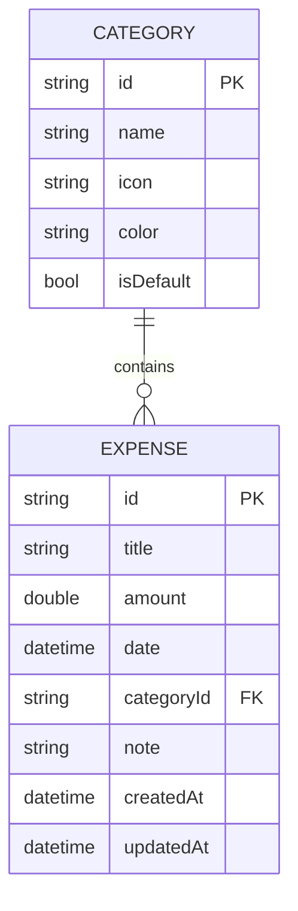

# My Expenses - Technical Architecture Solution

> **Personal Expense Management Application**  

## 📋 Table of Contents

1. [Architecture Overview](#architecture-overview)
2. [Technology Stack](#technology-stack)
3. [Project Structure](#project-structure)
4. [Layer Details](#layer-details)
5. [Data Models](#data-models)
6. [State Management](#state-management)
7. [Routing](#routing)
8. [Dependency Injection](#dependency-injection)
9. [Error Handling](#error-handling)
10. [Dependencies](#dependencies)

---

## 🏛️ Architecture Overview

```
┌─────────────────────────────────────────────────────────────────┐
│                      PRESENTATION LAYER                        │
│  ┌─────────────┐  ┌─────────────┐  ┌─────────────────────────┐  │
│  │   Screens   │  │   Widgets   │  │   Riverpod Providers    │  │
│  └─────────────┘  └─────────────┘  └─────────────────────────┘  │
└─────────────────────────────────────────────────────────────────┘
                              │
                              ▼
┌─────────────────────────────────────────────────────────────────┐
│                       DOMAIN LAYER                              │
│  ┌─────────────┐  ┌─────────────┐  ┌─────────────────────────┐  │
│  │   Entities  │  │  Use Cases  │  │  Repository Interfaces  │  │
│  └─────────────┘  └─────────────┘  └─────────────────────────┘  │
└─────────────────────────────────────────────────────────────────┘
                              │
                              ▼
┌─────────────────────────────────────────────────────────────────┐
│                        DATA LAYER                               │
│  ┌─────────────┐  ┌─────────────┐  ┌─────────────────────────┐  │
│  │   Models    │  │ Repositories│  │   Data Sources (Hive)   │  │
│  └─────────────┘  └─────────────┘  └─────────────────────────┘  │
└─────────────────────────────────────────────────────────────────┘
```

**Pattern**: Clean Architecture + Feature-First Organization

---

## 🛠️ Technology Stack

| Category | Technology | Purpose |
|----------|------------|---------|
| **Framework** | Flutter 3.x | Cross-platform UI |
| **State Management** | Riverpod 2.x | Reactive state management |
| **Local Database** | Hive + Hive Flutter | Fast NoSQL storage |
| **Routing** | GoRouter | Declarative navigation |
| **DI** | GetIt + Injectable | Dependency injection |
| **Error Handling** | fpdart (Either) | Functional error handling |
| **Code Generation** | build_runner, freezed | Immutable models |

---

## 📁 Project Structure

```
lib/
├── main.dart                          # Entry point
├── app.dart                           # App configuration
│
├── core/                              # Shared utilities
│   ├── constants/
│   │   ├── app_colors.dart
│   │   ├── app_strings.dart
│   │   ├── app_sizes.dart
│   │   └── hive_constants.dart
│   ├── theme/
│   │   ├── app_theme.dart
│   │   └── text_styles.dart
│   ├── utils/
│   │   ├── date_utils.dart
│   │   ├── currency_formatter.dart
│   │   └── validators.dart
│   ├── extensions/
│   │   ├── context_extensions.dart
│   │   ├── date_extensions.dart
│   │   └── string_extensions.dart
│   └── errors/
│       ├── failures.dart              # Failure classes for Either
│       └── exceptions.dart
│
├── data/                              # Data Layer
│   ├── models/
│   │   ├── expense_model.dart
│   │   ├── expense_model.g.dart       # Hive generated
│   │   ├── category_model.dart
│   │   └── category_model.g.dart
│   ├── datasources/
│   │   └── local/
│   │       ├── expense_local_datasource.dart
│   │       └── category_local_datasource.dart
│   └── repositories/
│       ├── expense_repository_impl.dart
│       └── category_repository_impl.dart
│
├── domain/                            # Domain Layer
│   ├── entities/
│   │   ├── expense.dart
│   │   └── category.dart
│   ├── repositories/
│   │   ├── expense_repository.dart    # Abstract interface
│   │   └── category_repository.dart
│   └── usecases/
│       ├── expense/
│       │   ├── add_expense.dart
│       │   ├── get_expenses.dart
│       │   ├── delete_expense.dart
│       │   └── get_expenses_by_category.dart
│       └── category/
│           ├── add_category.dart
│           └── get_categories.dart
│
├── features/                          # Feature Modules
│   ├── home/
│   │   ├── screens/
│   │   │   └── home_screen.dart
│   │   ├── widgets/
│   │   │   ├── expense_summary_card.dart
│   │   │   ├── recent_expenses_list.dart
│   │   │   └── quick_add_fab.dart
│   │   └── providers/
│   │       └── home_provider.dart
│   │
│   ├── expenses/
│   │   ├── screens/
│   │   │   ├── expenses_list_screen.dart
│   │   │   └── add_expense_screen.dart
│   │   ├── widgets/
│   │   │   ├── expense_tile.dart
│   │   │   ├── expense_form.dart
│   │   │   └── date_picker_field.dart
│   │   └── providers/
│   │       ├── expenses_provider.dart
│   │       └── expense_form_provider.dart
│   │
│   ├── categories/
│   │   ├── screens/
│   │   │   └── categories_screen.dart
│   │   ├── widgets/
│   │   │   ├── category_tile.dart
│   │   │   └── category_form_dialog.dart
│   │   └── providers/
│   │       └── categories_provider.dart
│   │
│   ├── statistics/
│   │   ├── screens/
│   │   │   └── statistics_screen.dart
│   │   ├── widgets/
│   │   │   ├── expense_pie_chart.dart
│   │   │   ├── monthly_bar_chart.dart
│   │   │   └── stats_summary_card.dart
│   │   └── providers/
│   │       └── statistics_provider.dart
│   │
│   └── settings/
│       ├── screens/
│       │   └── settings_screen.dart
│       └── widgets/
│           └── settings_tile.dart
│
├── shared/                            # Shared Widgets
│   └── widgets/
│       ├── custom_button.dart
│       ├── custom_text_field.dart
│       ├── loading_widget.dart
│       ├── error_widget.dart
│       └── empty_state_widget.dart
│
├── routing/                           # Navigation
│   ├── app_router.dart
│   └── route_names.dart
│
└── injection/                         # Dependency Injection
    ├── injection.dart
    └── injection.config.dart          # Generated
```

---

## 🔧 Layer Details

### 1. Presentation Layer (Features)

Each feature contains:
- **Screens**: Full-page widgets
- **Widgets**: Reusable UI components
- **Providers**: Riverpod providers for state

```dart
// Example: expenses_provider.dart
@riverpod
class ExpensesNotifier extends _$ExpensesNotifier {
  @override
  Future<List<Expense>> build() async {
    return await ref.watch(getExpensesUseCaseProvider).call();
  }

  Future<void> addExpense(Expense expense) async {
    await ref.read(addExpenseUseCaseProvider).call(expense);
    ref.invalidateSelf();
  }
}
```

### 2. Domain Layer

```dart
// Entity: expense.dart
class Expense {
  final String id;
  final String title;
  final double amount;
  final DateTime date;
  final String categoryId;
  final String? note;
}

// Repository Interface
abstract class ExpenseRepository {
  Future<Either<Failure, List<Expense>>> getExpenses();
  Future<Either<Failure, void>> addExpense(Expense expense);
  Future<Either<Failure, void>> deleteExpense(String id);
}
```

### 3. Data Layer

```dart
// Hive Model: expense_model.dart
@HiveType(typeId: 0)
class ExpenseModel extends HiveObject {
  @HiveField(0)
  late String id;

  @HiveField(1)
  late String title;

  @HiveField(2)
  late double amount;

  @HiveField(3)
  late DateTime date;

  @HiveField(4)
  late String categoryId;

  @HiveField(5)
  String? note;

  // Conversion methods
  Expense toEntity() => Expense(...);
  static ExpenseModel fromEntity(Expense e) => ExpenseModel()..;
}
```

---

## 📊 Data Models

### Core Entities



### Hive Type IDs

| Type ID | Model |
|---------|-------|
| 0 | ExpenseModel |
| 1 | CategoryModel |

---

## 🔄 State Management (Riverpod)

### Provider Architecture

```dart
// Provider hierarchy
┌─────────────────────────────────────────┐
│          UI (ConsumerWidget)            │
└─────────────────────────────────────────┘
                    │ watch/read
                    ▼
┌─────────────────────────────────────────┐
│      Feature Providers (Notifier)       │
│   expensesProvider, categoriesProvider  │
└─────────────────────────────────────────┘
                    │ ref.watch
                    ▼
┌─────────────────────────────────────────┐
│         UseCase Providers               │
│  getExpensesUseCaseProvider             │
└─────────────────────────────────────────┘
                    │ ref.watch
                    ▼
┌─────────────────────────────────────────┐
│       Repository Providers              │
│  expenseRepositoryProvider              │
└─────────────────────────────────────────┘
                    │ ref.watch
                    ▼
┌─────────────────────────────────────────┐
│      DataSource Providers               │
│  expenseLocalDataSourceProvider         │
└─────────────────────────────────────────┘
```

### Provider Examples

```dart
// providers/providers.dart

// DataSource Provider
@riverpod
ExpenseLocalDataSource expenseLocalDataSource(ExpenseLocalDataSourceRef ref) {
  return getIt<ExpenseLocalDataSource>();
}

// Repository Provider
@riverpod
ExpenseRepository expenseRepository(ExpenseRepositoryRef ref) {
  return ExpenseRepositoryImpl(
    ref.watch(expenseLocalDataSourceProvider),
  );
}

// UseCase Provider
@riverpod
GetExpenses getExpensesUseCase(GetExpensesUseCaseRef ref) {
  return GetExpenses(ref.watch(expenseRepositoryProvider));
}

// UI State Provider
@riverpod
class ExpensesList extends _$ExpensesList {
  @override
  Future<Either<Failure, List<Expense>>> build() async {
    return await ref.watch(getExpensesUseCaseProvider).call();
  }
}
```

---

## 🧭 Routing (GoRouter)

```dart
// routing/app_router.dart
final goRouterProvider = Provider<GoRouter>((ref) {
  return GoRouter(
    initialLocation: RouteNames.home,
    routes: [
      ShellRoute(
        builder: (context, state, child) => MainShell(child: child),
        routes: [
          GoRoute(
            path: RouteNames.home,
            name: 'home',
            builder: (context, state) => const HomeScreen(),
          ),
          GoRoute(
            path: RouteNames.expenses,
            name: 'expenses',
            builder: (context, state) => const ExpensesListScreen(),
            routes: [
              GoRoute(
                path: 'add',
                name: 'addExpense',
                builder: (context, state) => const AddExpenseScreen(),
              ),
            ],
          ),
          GoRoute(
            path: RouteNames.statistics,
            name: 'statistics',
            builder: (context, state) => const StatisticsScreen(),
          ),
          GoRoute(
            path: RouteNames.settings,
            name: 'settings',
            builder: (context, state) => const SettingsScreen(),
          ),
        ],
      ),
    ],
  );
});

// routing/route_names.dart
class RouteNames {
  static const home = '/';
  static const expenses = '/expenses';
  static const addExpense = '/expenses/add';
  static const categories = '/categories';
  static const statistics = '/statistics';
  static const settings = '/settings';
}
```

---

## 💉 Dependency Injection (GetIt)

```dart
// injection/injection.dart
final getIt = GetIt.instance;

Future<void> configureDependencies() async {
  // Hive Boxes
  final expenseBox = await Hive.openBox<ExpenseModel>('expenses');
  final categoryBox = await Hive.openBox<CategoryModel>('categories');
  
  getIt.registerSingleton<Box<ExpenseModel>>(expenseBox);
  getIt.registerSingleton<Box<CategoryModel>>(categoryBox);
  
  // DataSources
  getIt.registerLazySingleton<ExpenseLocalDataSource>(
    () => ExpenseLocalDataSourceImpl(getIt<Box<ExpenseModel>>()),
  );
  
  getIt.registerLazySingleton<CategoryLocalDataSource>(
    () => CategoryLocalDataSourceImpl(getIt<Box<CategoryModel>>()),
  );
}
```

---

## ⚠️ Error Handling (Either Type)

Using `fpdart` for functional error handling:

```dart
// core/errors/failures.dart
sealed class Failure {
  final String message;
  const Failure(this.message);
}

class DatabaseFailure extends Failure {
  const DatabaseFailure(super.message);
}

class ValidationFailure extends Failure {
  const ValidationFailure(super.message);
}

// Repository implementation
class ExpenseRepositoryImpl implements ExpenseRepository {
  final ExpenseLocalDataSource _localDataSource;

  @override
  Future<Either<Failure, List<Expense>>> getExpenses() async {
    try {
      final models = await _localDataSource.getAllExpenses();
      return Right(models.map((m) => m.toEntity()).toList());
    } catch (e) {
      return Left(DatabaseFailure('Failed to fetch expenses: $e'));
    }
  }
}

// Usage in Provider
@riverpod
class ExpensesList extends _$ExpensesList {
  @override
  Future<Either<Failure, List<Expense>>> build() async {
    final result = await ref.watch(getExpensesUseCaseProvider).call();
    return result.fold(
      (failure) => Left(failure),
      (expenses) => Right(expenses),
    );
  }
}
```

---

## 📦 Dependencies (pubspec.yaml)

```yaml
dependencies:
  flutter:
    sdk: flutter
  cupertino_icons: ^1.0.6
  
  # State Management
  flutter_riverpod: ^2.5.1
  riverpod_annotation: ^2.3.5
  
  # Local Database
  hive: ^2.2.3
  hive_flutter: ^1.1.0
  
  # Routing
  go_router: ^14.0.0
  
  # Dependency Injection
  get_it: ^7.6.7
  
  # Functional Programming
  fpdart: ^1.1.0
  
  # Utilities
  uuid: ^4.3.3
  intl: ^0.19.0
  
  # Charts
  fl_chart: ^0.66.2
  
  # UI
  google_fonts: ^6.1.0

dev_dependencies:
  flutter_test:
    sdk: flutter
  flutter_lints: ^3.0.0
  
  # Code Generation
  build_runner: ^2.4.8
  riverpod_generator: ^2.4.0
  hive_generator: ^2.0.1
  
  # Testing
  mocktail: ^1.0.3
```

---

## ✅ Feature Checklist

| Feature | Priority | Status |
|---------|----------|--------|
| Add/Edit/Delete Expenses | High | 🔴 |
| Category Management | High | 🔴 |
| Expense List with Filters | High | 🔴 |
| Home Dashboard | High | 🔴 |
| Statistics & Charts | Medium | 🔴 |
| Settings Screen | Low | 🔴 |
| Data Export | Low | 🔴 |

---

## 🧪 Testing Strategy

```
test/
├── unit/
│   ├── data/
│   │   └── repositories/
│   │       └── expense_repository_impl_test.dart
│   └── domain/
│       └── usecases/
│           └── get_expenses_test.dart
├── widget/
│   └── features/
│       └── expenses/
│           └── expense_tile_test.dart
└── integration/
    └── expense_flow_test.dart
```

---

## 🚀 Getting Started Commands

```bash
# Install dependencies
flutter pub get

# Generate Hive adapters & Riverpod providers
dart run build_runner build --delete-conflicting-outputs

# Run the app
flutter run
```

---
